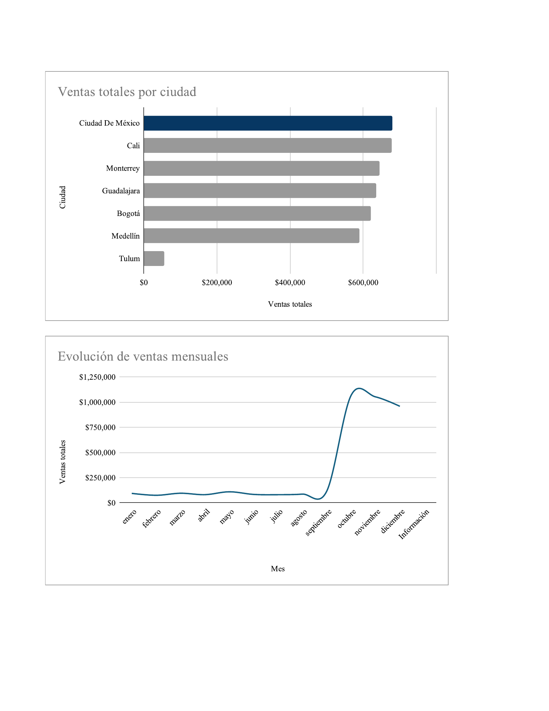

# Análisis de Ventas Q4 2024 — VentaExpress

**Pregunta de negocio:** ¿Qué patrones de ventas del cuarto trimestre de 2024 pueden
informar la estrategia comercial de enero de 2025?

## Contexto
VentaExpress es una empresa de e-commerce que vende tecnología (laptops, teléfonos,
auriculares, tablets) en México y Colombia. Se analizaron los datos de ventas de
octubre-diciembre 2024, entregados sin procesar (formato inconsistente, valores
duplicados y ausentes, columnas desorganizadas).

## Proceso
1. **Limpieza:** se identificaron y corrigieron caracteres especiales mal codificados,
   celdas vacías (12 en Precio unitario, 7 en Monto total), formato de columnas
   (símbolo de moneda, tipos de dato) y una fecha inválida (16/16/2024), eliminada
   tras verificar que no correspondía a ningún día real.
2. **Análisis:** cálculo de métricas por producto, ciudad, categoría y mes.
3. **Visualización:** construcción de gráficas ejecutivas para comunicar hallazgos.

## Hallazgos clave
- Producto más vendido por cantidad: Laptop-Oficina-32GB
- Ciudad con mayor volumen de ventas: Ciudad de México
- Precio promedio por categoría: Auriculares $1,253.74 · Laptop $1,305.42 ·
  Tablet $1,261.51 · Teléfono $1,281.17
- Las ventas crecen de forma pronunciada a partir de septiembre, alcanzando un
  máximo de ~$1.07M en octubre. Noviembre se mantiene casi al mismo nivel
  (-1.4%), pero diciembre presenta una caída más marcada de 8.9%
  (~$94K menos que noviembre).

## Recomendación
Analizar las estrategias de marketing aplicadas en octubre-noviembre para
replicarlas hacia enero y frenar la tendencia a la baja iniciada en diciembre.

## Limitaciones
Para profundizar el análisis sería necesario contar con datos de la ejecución
real de las campañas de marketing, y calcular la rentabilidad (no solo el
ingreso) para confirmar que ciudades como CDMX y Cali generan margen saludable,
no solo flujo de caja.

## Herramientas
Google Sheets (limpieza, análisis, visualización)

**Dataset completo:** [Ver en Google Sheets](https://docs.google.com/spreadsheets/d/1qVelKsjQykPKQqOiyyu1A5sLLQGvSSKn/edit?usp=sharing&ouid=106602298566061042272&rtpof=true&sd=true)
